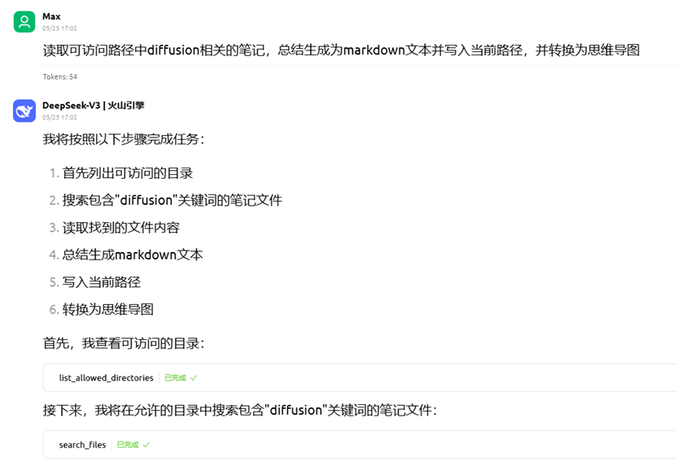

# MNote
a simple personal note system utilizing MCP during Nvidia 12th Sky Hackathon competition.

## Guide
Prerequisites：
- [Cherry Studio](https://www.cherry-ai.com/): A desktop client, used as MCP client in this project. 
- [Nodejs](https://nodejs.org/en): Javascript runtime environment. we need it to run some MCP server.
- [ffmpeg](https://ffmpeg.org/): a cross-platform tool for audio and video. In our project developing in Windows11, we download ffmpeg with this [link](https://www.gyan.dev/ffmpeg/builds/ffmpeg-release-essentials.zip).
> Do Not Forget to setup environment path!

Environment Setup:
This project includes ​​two locally running MCP server​​ and ​​two remotely invoked MCP server​​. The two remote MCP servers are **​​filesystem**​​ and **​​markmap**​​. Among them, ​​filesystem​​ is a built-in MCP service in Cherry Studio and can be installed via the official documentation [tutorial](https://docs.cherry-ai.com/advanced-basic/mcp), while ​[markmap](https://github.com/jinzcdev/markmap-mcp-server/tree/main)​ requires manual integration into Cherry Studio.


import by json format work well by testing.

The locally developed MCP servers all use ​​`uv`​​ to manage projects. If you haven't install `uv`, you can install it via `pip` command.
```cmd
pip install uv
```

After git cloning this repository locally, simply create a virtual environment to proceed.
```cmd
git clone https://github.com/MaxtomaxMax/MNote.git
uv venv
```
Then you need to install some dependencies. Run the following command:
```cmd
uv add fastmcp
uv pip install torch torchaudio openai pydub
uv pip install git+https://github.com/openai/whisper.git speechbrain
uv pip install soundfile
```


​​Next, you need to import the local MCP server into Cherry Studio. Below is a JSON-based import reference. The quick-creation method follows a similar process (TBD)
```json
"WrwmTih41WeliZa8A1WTF": {
      "name": "audio2md",
      "type": "stdio",
      "description": "将音频文件转换成markdown笔记",
      "isActive": true,
      "registryUrl": "",
      "command": "D:\\Your\\uv\\Path\\uv.exe",
      "args": [
        "--directory",
        "D:\\Your\\Path\\MNote",
        "run",
        "audio2md_server.py"
      ]
    },
"5QoifEQ_UdWgE8KLmDREq": {
      "name": "markdown-note-taker",
      "type": "stdio",
      "description": "获取markdown文件内容给大模型并生成结构化笔记的MCP工具",
      "isActive": true,
      "registryUrl": "",
      "command": "D:\\Your\\uv\\Path\\uv.exe",
      "args": [
        "--directory",
        "D:\\Your\\Path\\MNote",
        "run",
        "mcp_note_taker_server.py"
      ]
    },
```
Two API keys are required to run this project. Create `.env` file at the root of this project:
```
NVIDIA_API="<your NVIDIA API for NVIDIA NIM>"
OPENAI_API="<API from apiyi>"
```
Feel free to modify the corresponding API call code to your own version.

> Note: this Guide is not fully test yet. ​​If you encounter any problems during the environment setup, feel free to propose issue!​ 

---

# 项目报告：基于MCP的个人笔记助手

## 项目概述
本项目参与 Nvidia 12th Sky Hackathon 比赛，主题为实现完整功能的MCP智能体。本项目旨在打造一款基于 MCP 的个人笔记助手，该项目借助Nvidia NIM 微服务与开源 MCP 服务，完成了个人笔记助手智能体的构建。本项目结合了开源的远程 MCP 服务与本地开发调用的个人 MCP 服务，具有良好的拓展性，在借助 AI 进行个人知识管理的环境下中有较大应用潜力。

## 项目关键技术
- **基于 Cherry Studio 的 MCP 服务集成**：本项目采用开源免费的 AI 助手平台作为 MCP 客户端开发，它是一款集多模型对话、知识库管理、AI 绘画、翻译等功能于一体的全能平台，允许用户的高度自定义设计，与传统的 MCP 客户端平台 Claude Desktop 或 Github Copilot 相比开源又免费，有更好的开发自由度和扩展潜力。 
- **借助 MCP 工具发挥多模态交互潜力**：传统的个人知识体系构建在整合多模态信息时需要消耗大量的时间。例如整理课程视频或录音文件等，各种 MCP 工具的自由定制开发让智能体有了更强大的处理多模态信息的能力，它为多模态的个人知识体系的输入输出都赋予了强大的潜力。

## 项目开发
在有限的开发时间里（实际开发时间：5月23日至25日），本项目开发集成了4个 MCP 服务来实现个人笔记助手。这些 MCP 服务分别是：
- filesystem: 用于文件系统操作，支持读取、写入等多种文件操作
- audio2md: 将音频文件总结转换成 markdown 笔记文件，并保留原始文本
- markdown-note-taker：对以 markdown 格式的笔记进行总结，生成进阶笔记，生成知识图谱等
- markmap：将 markdown 文件或 markdown 格式的文本可视化成思维导图，可视化完成后支持一键转换为图片


### audio2md
音频处理工具：PyDub + FFmpeg

FFmpeg作为行业标准工具链，处理可靠性高。该音频处理方案支持MP3/WAV/M4A等主流格式的相互转换，可精确设置采样率(16kHz)、声道数(单声道)等音频参数，提供基于时间窗口的音频切片功能。

AI模型框架：Whisper + ECAPA-TDNN
使用 Whisper 模型进行语音识别，能够支持中英文混合识别，并有较高的准确率。结合 ECAPA-TDNN模型用于区别人声，将音频转换为短语音优化识别，能够区别不同人声，在会议音频和讨论音频等场景有丰富的应用潜力。

效果展示：


### filesystem
采用 Cherry Studio 内置的 MCP 服务，指定可访问的文件路径，使得智能体能够在该路径下操作文件。


### markdown-note-taker:
包含两个本地开发的 MCP 工具，均调用 Nvidia NIM 服务的 API 接口实现。通过设计专用的提示词实现智能体针对具体笔记操作的执行。其中包括：
- markdown_summarizer：针对 markdown 格式文本的总结工具。能够对单个以及多个 markdown 文件进行总结，并生成结构化的 markdown 格式输出。当某些笔记做得比较着急，没有时间整理其结构时，该工具为这种场景提供了解决方案。
- knowledge_map： 针对某一单一笔记内容，没办法第一时间得知该知识点在整个知识体系架构中处于什么位置，处于一种“不识庐山真面目”的情况。本工具获取笔记内容后能够生成对应的前置知识与进阶知识，并结合 markmap 工具对知识体系进行可视化，同样也有助于明确学习路径，迸发新的灵感。

（效果展示见 markmap 部分）

### markmap
基于开源项目 markmap 封装构建的 MCP 服务，能够实现从 markdown 转换为思维导图，并且生成的 html 文件中可以一键导出图片为 png, jpg, svg 格式。

以上 MCP 服务结合构建的个人笔记助手能够实现个人知识管理的操作，部分展示如下：




## 团队贡献
队长翁啟华负责完成 MCP 服务 audio2md 的代码以及调优；队员韩宇辰负责 MCP 服务 markdown-note-taker 的开发以及 MCP 服务集成与调试

## 未来展望
随着MCP技术的持续发展和工具生态的不断完善以及持续开发完善，这款个人笔记助手智能体将展现出更强大的知识管理能力。针对该项目我们有以下展望：
- ​​智能化程度提升​：充分发挥大模型的能力，个人知识管理系统中实现基于大模型的自动标签分类系统；结合 RAG 实现智能分类与关联潜在知识
- ​​多模态能力扩展​：支持视频内容解析与关键帧提取，实现视听一体化知识获取；开发手写笔记识别功能，打通纸质与数字笔记的界限
- ​​个性化体验优化​：通过持续学习用户习惯，提供个性化的知识推荐